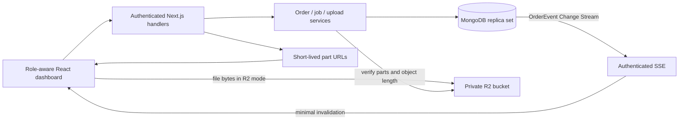
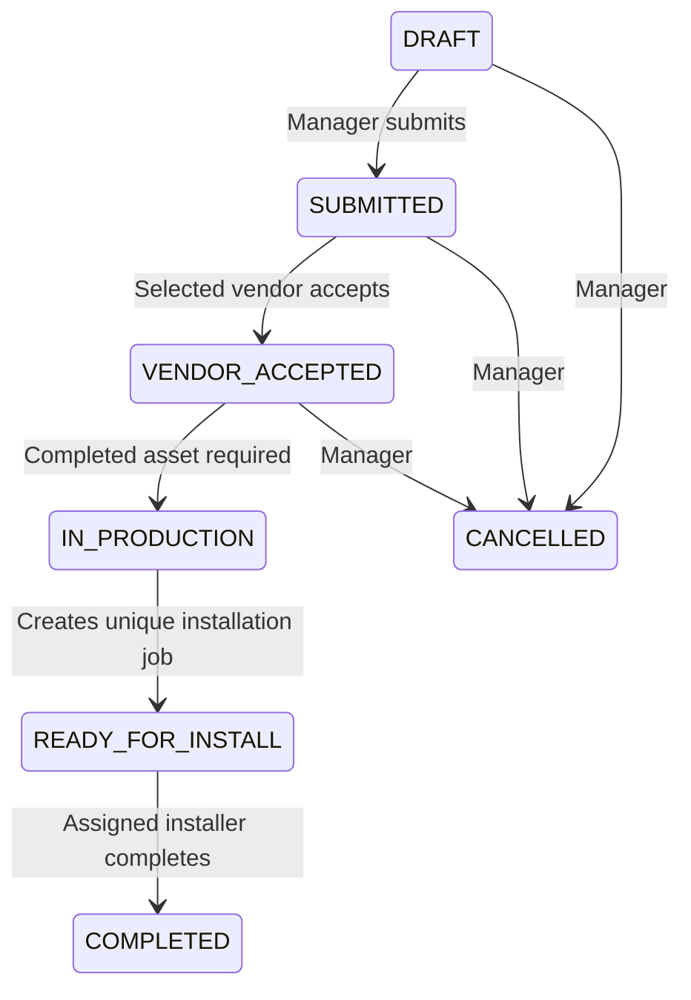
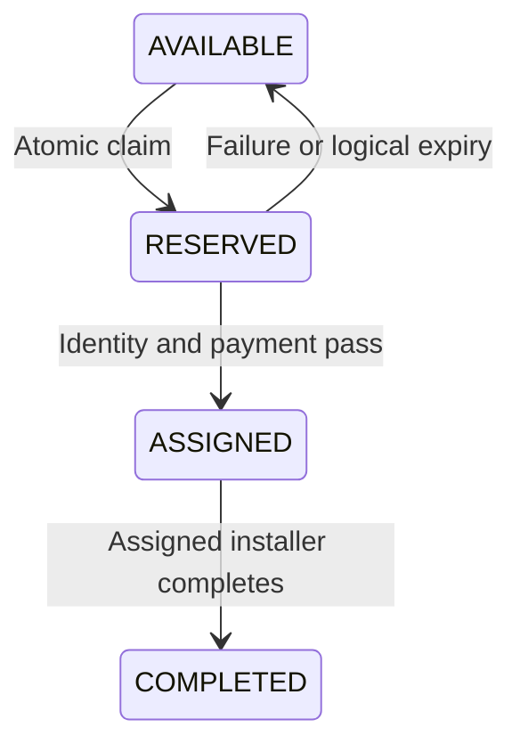

# SignCraft Operations

A role-aware signage operations dashboard: managers coordinate orders, vendors produce signage, and installers reserve and complete installation jobs.

## Run locally

Requires **Node 24** and npm. The MongoDB database must run as a replica set for transactions and Change Streams.

```sh
npm ci
npm run db:local
```

Keep that terminal open. The launcher downloads a real MongoDB binary, starts a single-node replica set on port **27027**, stores data in `.local/mongo`, and creates `.env` with a randomly generated local auth secret if the file does not already exist. It does not change an existing MongoDB installation. In a second terminal:

```sh
npm run db:push
npm run db:seed
npm run dev
```

Open http://localhost:3000. For a production run, use `npm run build` followed by `npm start` instead of `npm run dev`.

For an existing replica set or Atlas database, copy `.env.example` to `.env`, configure the connection and a random auth secret, then run the push, seed, and app commands. Never seed an unrelated database. Seeding is additive and safe to rerun: existing users, passwords, orders, and workflow progress are preserved.

### Demo accounts

All seeded accounts use password **`SignCraft!2026`**. These are intentionally public demo credentials. Use only fictional data in this assignment workspace.

| Role | Email | Name |
|---|---|---|
| Manager | manager@signcraft.demo | Alex Morgan |
| Vendor | vendor1@signcraft.demo | Northline Print Studio |
| Vendor | vendor2@signcraft.demo | Forma Fabrication |
| Installer | installer1@signcraft.demo | Jordan Lee |
| Installer | installer2@signcraft.demo | Sam Rivera |
| Installer | installer3@signcraft.demo | Casey Brooks |

There is no signup, customer account, or password-reset flow.

## Stack

Next.js App Router, TypeScript, React, MUI, Tailwind CSS, Zod, React Hook Form, TanStack Query, Auth.js credentials, MongoDB, Prisma, AWS S3 SDK, Vitest, and Playwright. Exact resolved dependency versions are committed in `package-lock.json`. Prisma CLI and client are both pinned to **6.19.0**, the documented MongoDB-compatible v6 line.

The machine-wide Node 18 installation is not supported. Use Node 24; the app was developed with the bundled Node 24 runtime.

## Architecture



- `src/domain`: shared lifecycle definitions, validation, errors, and expiry rules.
- `src/server`: resource authorization, transactional mutations, storage integration.
- `src/app/api`: authentication, thin action dispatch, and SSE transport.
- `src/components`: dashboard, forms, upload progress, verification and countdown.
- `prisma`: MongoDB schema and idempotent seed.
- `tests`: unit, real-database integration, and browser workflow tests.

### Data model

| Entity | Purpose / key indexes |
|---|---|
| User | Hashed password, name, role; unique email |
| Order | Business/contact details, vendor, lifecycle, revision; vendor/status and status/date indexes |
| InstallationJob | Separate claim/verification/assignment lifecycle; unique orderId; status/expiry and installer indexes |
| Asset | Object key, file metadata, mode, lifecycle, revision; unique objectKey and order index |
| OrderEvent | Actor, role, event type, order revision, UTC timestamp, safe details; order/timestamp index |
| LoginAttempt | Shared per-account fixed-window login attempt count |

Money is integer USD cents. Installation dates are validated business-date strings (`YYYY-MM-DD`). Timestamps and reservation deadlines are UTC. MongoDB ObjectIds identify entities. Prisma models use explicit ID references; services enforce ownership and referential checks.

### Order lifecycle



The same transition map controls frontend actions and backend checks. Invalid jumps return 400. Invalid roles return 403 or a resource-scoped 404. Completed and cancelled orders are terminal. Edits are allowed only in draft. Exceptional manager overrides are deliberately not exposed.

### Installation lifecycle and concurrency



Claiming uses a MongoDB conditional update inside a transaction. Its predicate requires the job to be unassigned and either `AVAILABLE` or `RESERVED` with `expiresAt <= serverNow`. The transaction checks that the associated order is ready for installation. That order has no other legal exit except assigned-installer completion. The write stores a random claim ID, owner, UTC reservation time, deadline of exactly 180 seconds, reset verification fields, and an incremented revision. An audit event commits in the same transaction.

Competing transactions retry bounded transient conflicts. After the winner commits, all losers fail the predicate and receive **409**. Correctness does not depend on Node process state, distributed locks, a browser timer, or an external scheduler.

`expiresAt` is authoritative. Reads normalize expired reservations to available, and new claims can directly replace them. No cleanup callback is necessary. A replacement records expiry in history. Verification requires matching owner, claim ID, revision, status, and an unexpired server deadline. Old claims cannot mutate newer reservations. Assignment clears the deadline; assigned jobs cannot be stolen. Completion atomically closes both order and installation job and writes history.

Installers may reserve multiple different jobs; this assignment imposes no per-installer capacity limit.

### Authentication and authorization

Auth.js uses credential authentication with bcrypt hashes and signed, HTTP-only JWT sessions. Cookies use HTTPS security in production. Each API request resolves the current user and role from MongoDB. Login attempts are limited to 15 per normalized account per 15-minute fixed window in the shared database. Mutation routes reject foreign browser origins.

Managers see all orders. Vendors see only their assigned orders and completed assets. Installers receive a restricted job projection without customer contact fields, internal notes, asset keys, or other installers' claim IDs. Installer access to order details and downloads is rejected. Upload metadata, file sizes, revisions, IDs, and form input are validated server-side.

### Verification simulation

Identity and payment are explicit simulated actions. Identity must pass first. No identity documents, card details, or payment provider are involved. The UI shows request progress and a countdown corrected by server time. With `DEMO_MODE=true`, a visible failure action releases the reservation and records history.

### Upload pipeline

1. Manager initiates an asset; the server validates its order and a maximum size of 2 GiB, then creates a server-owned object key.
2. Client requests at most three part URLs per call; part size is 16 MiB, with three concurrent browser workers.
3. In R2 mode, XHR sends bytes directly to storage. Progress reflects uploaded bytes. Failed parts are retried up to three times with fresh URLs.
4. Completion verifies provider-reported parts and object size before marking the asset complete. Client assertions alone are insufficient.
5. Abort/failure updates lifecycle and aborts the multipart upload. Users can retry as a new upload.
6. Authorized downloads receive a 60-second signed URL. The bucket remains private.

**Current default: simulation.** Simulated part URLs use the reserved `.invalid` domain and are not fetched. No bytes leave the browser, pass through Next.js, or get stored in MongoDB. Progress is explicitly simulated. Server-issued, expiring HMAC receipts and a minimum duration validate the simulated protocol; they are not evidence of real stored file bytes. Seed assets are also simulations. The View action explains this instead of returning a nonexistent file.

R2 support is implemented but **not externally verified**. Set the R2 variables and `UPLOAD_MODE=r2`, configure bucket CORS with the exact app origin, `PUT`/`GET`/`HEAD`, allowed `Content-Type` headers, and exposed `ETag`, then verify a large upload and private download before claiming provider success. Configure lifecycle cleanup for abandoned multipart uploads. A storage completion followed by database failure currently requires operational reconciliation; do not treat the unverified R2 path as production hardened.

### Live updates

Authenticated SSE watches inserted `OrderEvent` records through native MongoDB Change Streams. Events contain only a scope invalidation signal. Vendor visibility is checked against current order ownership; installers receive only job-related invalidations, never history bodies or contact data. TanStack Query refreshes authoritative views. Upload-byte progress remains local to the uploading browser.

Connections heartbeat every 15 seconds and close at 50 seconds to bound function duration. Reconnect uses exponential backoff (up to 30 seconds), refreshes queries, and shows connection status. A manual refresh is always available. There is no interval-based database polling. Hosted SSE and reconnection still require a Vercel smoke test.

## Configuration

| Variable | Purpose |
|---|---|
| DATABASE_URL | MongoDB replica-set / Atlas URL |
| AUTH_SECRET | Random secret, at least 32 characters |
| AUTH_URL | Canonical app origin |
| AUTH_TRUST_HOST | `true` only behind a trusted deployment proxy / localhost |
| UPLOAD_MODE | `simulation` (default) or `r2` |
| DEMO_MODE | `true` enables intentional verification failure |
| R2_ACCOUNT_ID | Cloudflare account ID |
| R2_ACCESS_KEY_ID | Private S3 API key ID |
| R2_SECRET_ACCESS_KEY | Private S3 secret |
| R2_BUCKET | Private bucket name |

Do not commit `.env`, storage credentials, or signed URLs. `.env.example` contains placeholders only.

## Docker

Set a random `AUTH_SECRET` in `.env`, then:

```sh
docker compose up --build
```

Compose starts a MongoDB replica set, applies indexes, seeds once, and starts the standalone app. Data persists in a named volume. The application image runs as the non-root `node` user. Docker files are provided but execution was not verified because Docker is unavailable on the development machine.

## Verification

```sh
npm run typecheck
npm run lint
npm test
npm run test:integration
npm run build
# Start app + seeded local database, then:
npx playwright install chromium
npm run test:e2e
```

Integration tests launch a separate real MongoDB replica set with an isolated database. They never reset the configured application database. Tests cover the legal/illegal lifecycle matrix, roles, stale revisions, 20 concurrent claims, independent Node processes, expiry/reclaim, stale claim IDs, verification ownership/failure, terminal assignment, transactional completion, upload size checks, forged receipts, and abort. Browser tests exercise the full manager/vendor/installer flow and mobile layout. Browser tests add uniquely named fictional orders to the running demo database.

## Reviewer walkthrough

1. Sign in as Manager and create a draft with Northline Print Studio selected.
2. Upload a PDF in simulation mode and submit the order.
3. In a separate browser profile, sign in as vendor1. Accept, start production, and mark ready.
4. In two installer sessions, attempt to claim the same job. One succeeds; the other sees a conflict.
5. Observe the three-minute countdown. Test failure or wait for expiry and reclaim.
6. Pass simulated identity and payment verification, then complete installation.
7. Return to Manager and inspect the completed order and history.
8. Run the integration suite for repeatable 20-way and cross-process contention evidence.

## Deployment and known limits

Connect the repository to Vercel, select Node 24, configure Atlas with a replica set and network access, set environment variables, apply indexes and seed the dedicated demo database, and deploy. Then verify all role logins, cross-session SSE, reconnect, claims, and expiry on the hosted environment. R2 is optional; the simulation mode satisfies the assignment's upload simulation requirement.

The private source repository is [hbubh/signcraft-operations](https://github.com/hbubh/signcraft-operations). No hosted application URL has been published yet; Atlas/Vercel configuration remains pending. See `IMPLEMENTATION_STATUS.md` for deviations and outstanding external checks. The installer board is bounded to 200 jobs; order search is paginated. Optional readiness heuristics, matching scores, admin overrides, and the manager concurrency-demo button are omitted.

The dependency audit currently reports advisories in Prisma CLI's transitive `effect` and `deepmerge-ts` dependencies. They are development/build dependencies, not the shipped standalone request path. Prisma remains pinned for MongoDB compatibility; no automatic major upgrade or unsupported override was applied.
